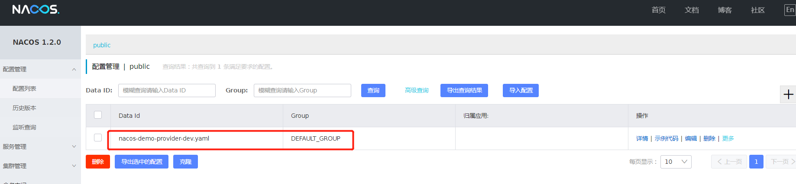
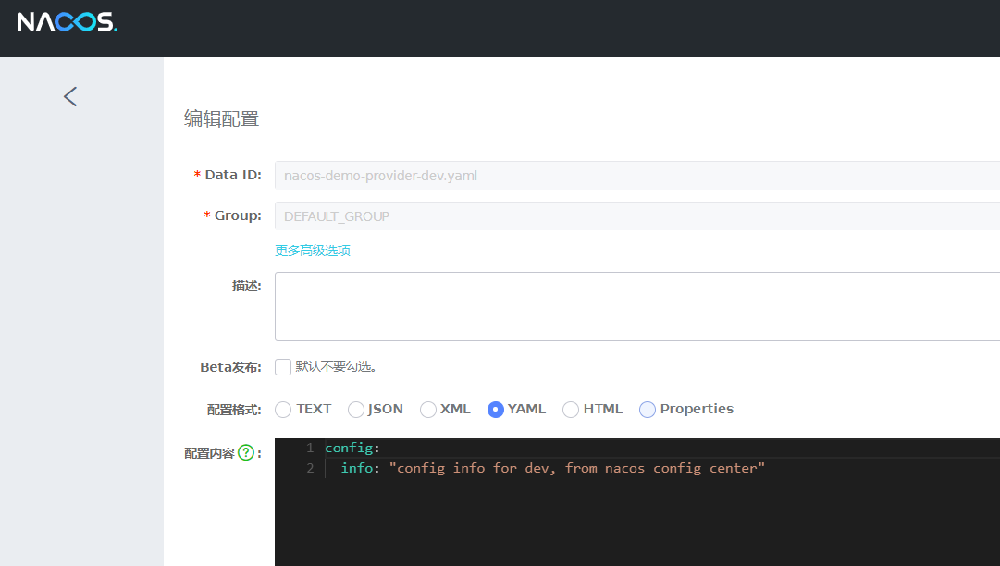

pom.xml配置，同时配置discover和config的依赖，表示使用安装在服务器的nacos作为注册中心和配置中心
启动后cosole打印：
```
2020-03-17 13:35:38.899  INFO 968 --- [           main] b.c.PropertySourceBootstrapConfiguration : Located property source: [BootstrapPropertySource {name='bootstrapProperties-nacos-demo-provider-dev.yaml,DEFAULT_GROUP'}, BootstrapPropertySource {name='bootstrapProperties-nacos-demo-provider.yaml,DEFAULT_GROUP'}, BootstrapPropertySource {name='bootstrapProperties-nacos-demo-provider,DEFAULT_GROUP'}]
2020-03-17 13:35:38.906  INFO 968 --- [           main] c.javasea.nacos.DemoProviderApplication  : The following profiles are active: dev
2020-03-17 13:35:44.616  INFO 968 --- [           main] com.alibaba.nacos.client.naming          : [BEAT] adding beat: {"cluster":"DEFAULT","ip":"192.168.1.107","metadata":{"preserved.register.source":"SPRING_CLOUD"},"period":5000,"port":8080,"scheduled":false,"serviceName":"DEFAULT_GROUP@@nacos-demo-provider","stopped":false,"weight":1.0} to beat map.
2020-03-17 13:35:44.821  INFO 968 --- [           main] com.alibaba.nacos.client.naming          : [REGISTER-SERVICE] public registering service DEFAULT_GROUP@@nacos-demo-provider with instance: {"clusterName":"DEFAULT","enabled":true,"ephemeral":true,"healthy":true,"instanceHeartBeatInterval":5000,"instanceHeartBeatTimeOut":15000,"ip":"192.168.1.107","ipDeleteTimeout":30000,"metadata":{"preserved.register.source":"SPRING_CLOUD"},"port":8080,"weight":1.0}
2020-03-17 13:35:45.094  INFO 968 --- [           main] c.a.c.n.registry.NacosServiceRegistry    : nacos registry, DEFAULT_GROUP nacos-demo-provider 192.168.1.107:8080 register finished
2020-03-17 13:35:45.694  INFO 968 --- [           main] c.javasea.nacos.DemoProviderApplication  : Started DemoProviderApplication in 11.918 seconds (JVM running for 13.07)
```





配置的内容如下：

```java
config:
  info: "config info for dev, from nacos config center"
```

测试配置中心：http://localhost:8080/config/info

参考：https://nacos.io/zh-cn/docs/quick-start-spring-cloud.html
参考：http://www.iocoder.cn/Spring-Cloud-Alibaba/Nacos-Discovery/?self

